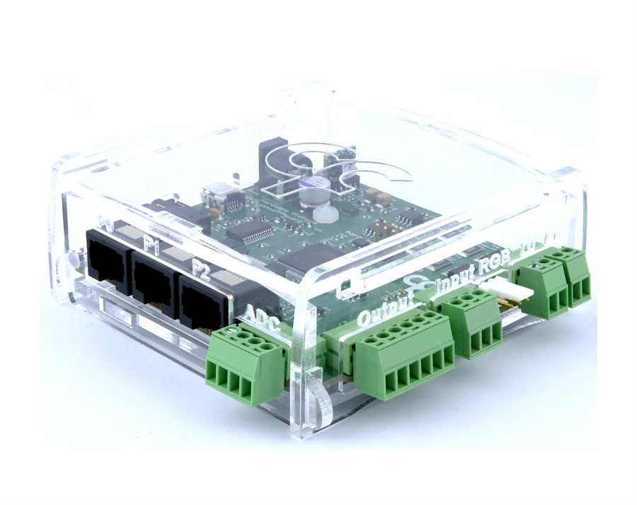
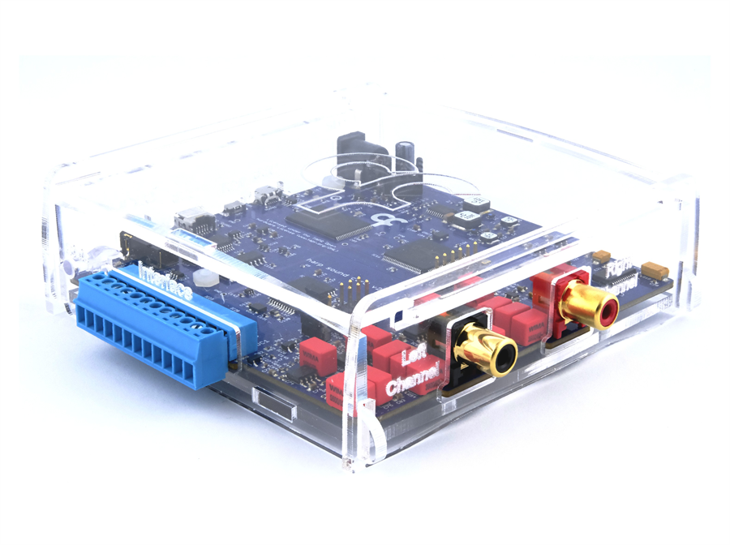
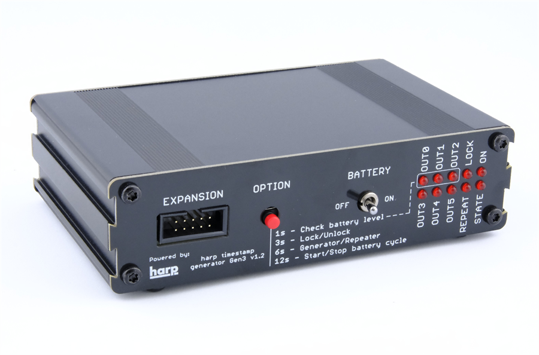

## Overview

This is a list of devices contributed to the harp-tech organization. Harp-tech devices are open-source hardware, you can either assemble your own or purchase them from a partner distributor. Each card links to the device documentation site where you can find out more.

:::: device-grid

::: device-card

[Harp Behavior](https://harp-tech.org/device.behavior/)

The Harp Behavior board is a multi-purpose data acquisition and control device for behavioral neuroscience experiments.
:::

::: device-card

[Harp Sound Card](https://harp-tech.org/device.soundcard/)

The Harp Sound Card is an open-source, high-fidelity audio devices specifically designed for behavioral research experiments.
:::

::: device-card

[Harp Timestamp Generator Gen3](https://harp-tech.org/device.timestampgeneratorgen3/)

The Harp Timestamp Generator Gen3 is a clock synchronization device for the Harp ecosystem.
:::

::::
